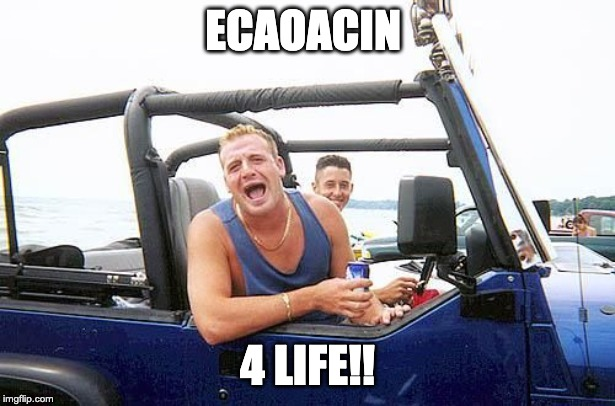

```{r}
knitr::opts_chunk$set(echo = TRUE)
```


#### Download,  access and run project_setup.R ####

(Note: we ultimately can do this in main, but this is a bridge)


Try downloading and accessing my basic content support tool...


```{r download-project-setup}
library(here)


library(devtools)
tryCatch(
  {
     download.file(url = "https://raw.githubusercontent.com/daaronr/dr-rstuff/master/functions/project_setup.R", destfile = here("code", "project_setupX.R"))
  },  error = function(e) {
  print("you are not online, so we can't download")
  }
)

tryCatch(
  file.rename(here("code", "project_setupX.R"), here("code", "project_setup.R"))
)
```

```{r run-project-setup}

source(here("code", "project_setup.R"))

```


\

```{r install,  echo = FALSE, include=FALSE}
library(png)
library(grid)
```


```


# install.packages("bookdown")
# or the development version
# devtools::install_github("rstudio/bookdown")

<!-- Download 'backup' bibtex file from dropbox (synced with Zotero), do the rename workaround -->


<!-- note installing packages is mainly removed because this is done in baseoptions.R -->

```{r }
# automatically create a bib database for R packages
knitr::write_bib(c(
  .packages(), 'bookdown', 'knitr', 'rmarkdown'
), 'packages.bib')
```


```{r html, echo=FALSE}
# globally set chunk options
knitr::opts_chunk$set(fig.align='center', out.width='80%')

my_output <- knitr::opts_knit$get("rmarkdown.pandoc.to")

```

<!--
Can define text blocks here, refer to them again and again if desired
-->

<!-- Global site tag (gtag.js) - Google Analytics -->


<html>

<script async src="https://www.googletagmanager.com/gtag/js?id=G-QLKFNFTGXX"></script>
<script>
  window.dataLayer = window.dataLayer || [];
  function gtag(){dataLayer.push(arguments);}
  gtag('js', new Date());

  gtag('config', 'G-QLKFNFTGXX');
</script>
</html>

<!--chapter:end:index.Rmd-->

# About this work {-}

```{block2,  type='note'}
Click [HERE](#chapter_2) to jump to next chapter.
```


`r format_with_col("**Note to friends I've asked to look at this book...**","brown")`

`r format_with_col("Thanks for looking at this.", "brown")`

## Preface {#preface}


**Leaving feedback, asking questions, seeking other's feedback/notes/questions:**

*All feedback is appreciated, and I will try to respond to your questions.* An easy way to take notes and leave feedback: sign up for ['hypothes.is'](https://web.hypothes.is/) and you can put your 'public notes' *directly on this web book.* Don't worry, these comments are saved even if the web book is updated.

> an example of a quotation  example of a quotation example of a quotation example of a quotation example of a quotation example of a quotation example of a quotation example of a quotation example of a quotation.
ddddddd 


<!--
(As noted at <https://www.econometrics-with-r.org/>; thanks for this example:)
-->

<div class = rmdreview>
This book is in <b>Open Review</b>. We want your feedback to make the book better for you and other students. You may annotate some text by <span style="background-color: #3297FD; color: white">selecting it with the cursor</span> and then click the <i class="h-icon-annotate"></i> on the pop-up menu. You can also see the annotations of others: click the <i class="h-icon-chevron-left"></i> in the upper right hand corner of the page <i class="fa fa-arrow-circle-right  fa-rotate-315" aria-hidden="true"></i>
</div>

<div class="marginnote">
 
If you have benefitted from this work (and you are not one of my students), please consider giving me some sort of ''kudos'' on Twitter or wherever. One way to materially express gratitude: make a donation in my honor to an *effective and international charity*, such as those listed at [givewell.org](givewell.org). If you make this donation and share it on a social media site with the hashtag #DRWritingEcon, that would be greatly appreciated.

</div>

### Licence {-}

Essentially:

- You can use this freely and create other versions as long as you give proper attribution, and you make your work publicly available

- You cannot sell this or use it, or any part of it, for commercial purposes

https://creativecommons.org/licenses/by-nc-sa/4.0/

<a rel="license" href="http://creativecommons.org/licenses/by-nc-sa/4.0/"></a><br /><span xmlns:dct="http://purl.org/dc/terms/" property="dct:title">Researching and writing in Economics (Essays, term paper, dissertations for Economics undergraduates and MSc students)</span> by <a xmlns:cc="http://creativecommons.org/ns#" href="https://github.com/daaronr/writing_econ_research" property="cc:attributionName" rel="cc:attributionURL">David Reinstein</a> is licensed under a <a rel="license" href="http://creativecommons.org/licenses/by-nc-sa/4.0/">Creative Commons Attribution-NonCommercial-ShareAlike 4.0 International License</a>.


## Citations

Let's cite a paper here: [@Akerlof1984a]; I don't think I needed the brackets though (@Akerlof1984a would also have worked).

Testing another one: [@alecstephensonQuickIntroductionShiny2013]
  

It is referring the contents of bibtex files, in the line `bibliography: [./references.bib, support/reinstein_bibtex.bib]`


<div class="marginnote">
 This can be made easier with the addin citation tool 'citr', along with Zotero and betterbibtex.
</div>


## Examples of the sort of fancy interactive stuff I hope to incorporate in this web book

Thanks to Yihui and many others, this book should permit lots of flexible tools. Trying some of these below (with code shown, but it could also be hidden). Thanks Yihui for the [Bookdown package](https://bookdown.org/yihui/bookdown/).

### Questions with folded answers, folded expanded discussions

Can I ask you a question? (Answer below the fold.)


```{block2,  type='fold'}

Yes: I just did.

```


\

I can also put expansive detail into the fold, to avoid clutter. If you want to know more about spittlebugs, feel free (to open the fold below).


```{block2,  type='fold'}

> These families are best known for the nymphal stage, which produces a cover of foamed-up plant sap visually resembling saliva; the nymphs are therefore commonly known as spittlebugs and their foam as cuckoo spit, frog spit, or snake spit. This characteristic spittle production is associated with the unusual trait of xylem feeding. Whereas most insects that feed on sap feed on the nutrient-rich fluid from the phloem, Cercopidae utilize the much more dilute sap flowing upward from the roots via the xylem. The large amount of excess water that must be excreted and the evolution of special breathing tubes allow the young spittlebug nymphs to grown in the relatively protective environment of the spittle.

Indirect source: [wikipedia: Froghopper, accessed 21 Feb 2020](https://en.wikipedia.org/wiki/Froghopper)

```

### A Shiny app {-#shiny_test}

```{r knitrapp}

knitr::include_app("https://yihui.shinyapps.io/miniUI/",
  height = "600px")

```

### My web pages {-}

[innovationsinfundraising.org](https://innovationsinfundraising.org/doku.php)

(This page couldn't embed)

***

```{r wppage}

knitr::include_url("https://davidreinstein.wordpress.com/")

```


### Scary math {-}

$$\Theta = \begin{pmatrix}\alpha & \beta\\
\gamma & \delta
\end{pmatrix}$$

### R code and data {-}

These are "code chunks"

```{r chunk-label, echo = FALSE, fig.cap = 'A figure caption.'}
x <- 1 + 1
rnorm(10)  # 10 random numbers
plot(dist ~ speed, cars)  # a scatterplot
```

And I can refer to the results of the r code in the text itself, e.g., by writing

````
``  one plus one equals  ` r x `   ``
````

I get ... one plus one equals `r x`.

### Other fancy stuff {-}


```{r, eval = my_output == "html", results='asis', echo=F, purl=F}
cat('
<div class = "keyconcept" id="KC5.4">
<h3 class = "right"> Key Concept 5.4 </h3>
<h3 class = "left"> Heteroskedasticity and Homoskedasticity </h3>
- The error term of our regression model is homoskedastic if the variance of the conditional distribution of $u_i$ given $X_i$, $Var(u_i|X_i=x)$, is constant *for all* observations in our sample:
\\[ \\text{Var}(u_i|X_i=x) = \\sigma^2 \\ \\forall \\ i=1,\\dots,n. \\]

</div>
')
```


### Interactive questions

```{r, echo=FALSE}
knitr::include_app('https://os301.shinyapps.io/Question/', height = "210px")

#Code for this is detailed below
# library(shiny)
# ui <- fluidPage(
#     radioButtons("rb", "In equilibrium what is Quantity demanded equal to?",
#                        choiceNames =
#                            list("None selected", "Quantity Supplied", "Bananas",
#                                 "Apples", "Pears"),
#                        choiceValues =
#                            list("", "supply", "demand", "price", "quantity"),
#                  selected = ""
#     ),
#     textOutput("txt")
#     )
# server <- function(input, output) {
#     output$txt <- renderText({
#         if (input$rb == "supply"){
#             print("You are correct")
#             } else if (input$rb == ""){
#                 print("")}
#                 else{
#                     print("You are incorrect")}
#             })
# }
# shinyApp(ui, server)
```

### Videos

```{r, echo=FALSE}
knitr::include_app('https://os301.shinyapps.io/Video/')
# Code for this is detailed below
# library(shiny)
# ui <- fluidPage(
#     HTML('<iframe width="560" height="315" src="https://www.youtube.com/embed/WyrhmqHfdu8" frameborder="0" allow="accelerometer; autoplay; encrypted-media; gyroscope; picture-in-picture" allowfullscreen></iframe>')
# )
# server <- function(input, output, session) {
# }
# shinyApp(ui, server)

```


## Types of notes within text


```{block2,  type='note'}

"Aside" notes look like this.

```

```{block2,  type='warning'}

Warnings look like this.

```


### A margin note

<div class="marginnote">
If you are considering pursuing an MSc or PhD this will typically be centered on doing research; it's worth knowing whether this is for you before diving in. Doing research is also a key component of much professional work in the private and public (government) sectors, including at 'think tanks', some government agencies, and many private consulting and 'data analytics' firms.
</div>


## Notes for instructors and course organisers {-}

Note: related pptx slides (covering Ch 1-3, adapted to Exeter) are downloadable:


<button onclick="window.open('Lecture1_intro_andyourtopic_exeter.pptx')">Download</button>
## We link back here in the next chapter -- check it out {#link_back}


Jump to [next chapter](#chapter_2)


### A fun acronym

**Six simple rules for writing a good paper** (and, incidentally, for getting a good mark)

1. Frame your topic as an interesting, well-defined **Economic** question. Demonstrate that you understand your question.

2. Explain what others have written about your topic and which techniques they used. **[Critically](#crit_examine) discuss** the strengths and limitations these. Explain how these relate to and inform your own work. Cite correctly and do not plagiarise.

3. **Apply economics** (and econometrics) to your question. Demonstrate an understanding of your approach and techniques.

4. **Organise and present** your work clearly, including an outline and labels and explanations of any tables, graphs, and equations.

5. Write clearly, logically, and in a professional **academic** style.

6. If you are aiming to produce a great paper, make an original contribution or **insight.** (This can be a small insight, and it is not always necessary for a top mark.)

***

```{r  fig.cap = 'Just remember...', out.width='40%', fig.asp=.4, fig.align='center',  echo = FALSE}



```

Just remember the simple acronym "ECAOAcIn":^[(Isn’t that catchy?)]

**E**conomic question -- **C**ritical discussion -- **A**pply economics --  **O**rganise/present well -- **Ac**ademic writing -- original **In**sight


<!--chapter:end:chapter_1_sample.Rmd-->

# Second sample chapter {#chapter_2}


Blah blah

## Test

### Link back to first chapter

Link back to the first chapter [here](link_back)

## Blah

### A proposed lecture programme {-}

*Note:* I have slides covering a range of key topics, which tie in with this web book. Please contact me directly for details.

<br>

\

Large lectures have limited value in this context. From my experience students appreciate *occasional* lectures for motivation and clarification, and to ask questions, but more than 5-6 traditional lectures seems to be overkill.

If resources permit, it will be helpful to intersperse this with casual scheduled 'research coffees', encouraging students to discuss their ideas with instructors and with each other. I recommend a 'light-touch approach' in sessions. Let the students take the lead in presenting and responding (making occasional course-corrections where necessary). From our experience, students engage actively in these contexts!


# Works Cited

# Appendix

## Alphabetical list of abbreviations


## Abbreviations: Notes for paper marking and commenting

Here is a categorized list of abbreviations I use in marking; you may
find it useful just to read these to be aware of common issues.

- (abbreviations as pdf)[https://github.com/daaronr/writing_econ_research/blob/master/ec831%20lecture%20slides%20(powerpoint)/abbreviations%20for%20editing%20-%20alphaall%20(David%20Reinstein's%20conflicted%20copy%202012-05-15).pdf] - download and view

- (link to page to download spreadsheet)](https://github.com/daaronr/writing_econ_research/blob/master/ec831%20lecture%20slides%20(powerpoint)/abbreviations%20for%20marking%20-%20forstudents.xlsx)

- [Airtable view link (sortable etc)](https://airtable.com/shrPGYSbNvnUV4TzU)


\

<iframe class="airtable-embed" src="https://airtable.com/embed/shrPGYSbNvnUV4TzU?backgroundColor=purple&viewControls=on" frameborder="0" onmousewheel="" width="100%" height="533" style="background: transparent; border: 1px solid #ccc;"></iframe>


<!--chapter:end:chapter_2_sample.Rmd-->

# List of works cited {#references}

<!--chapter:end:references.Rmd-->

